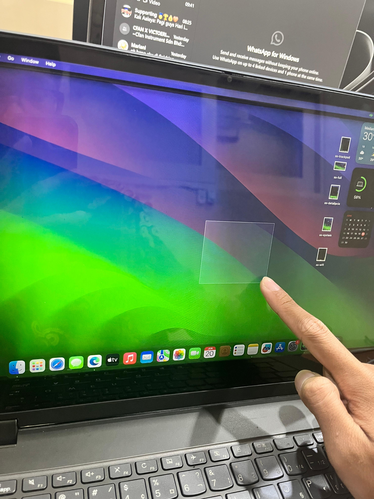
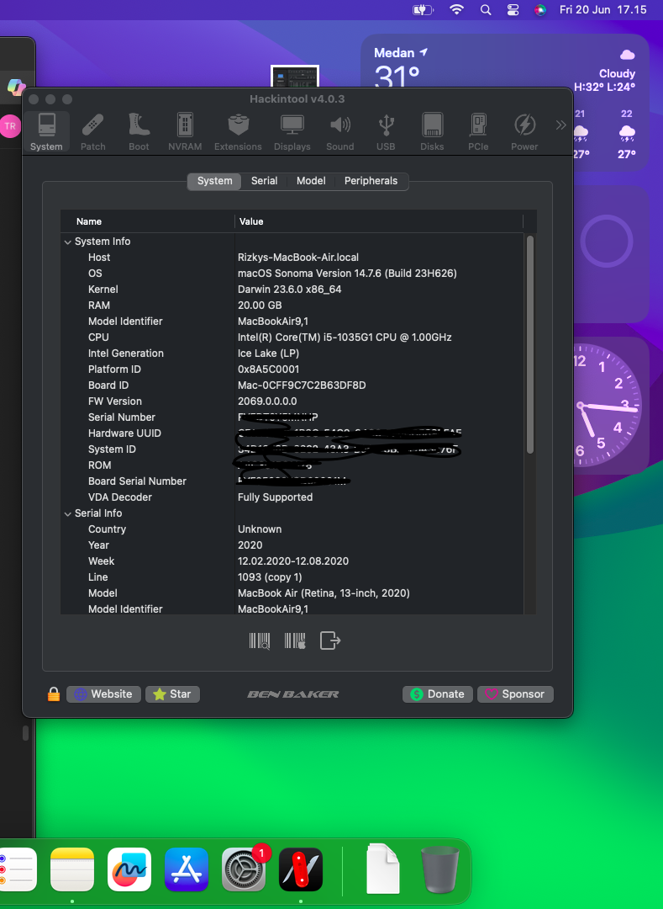
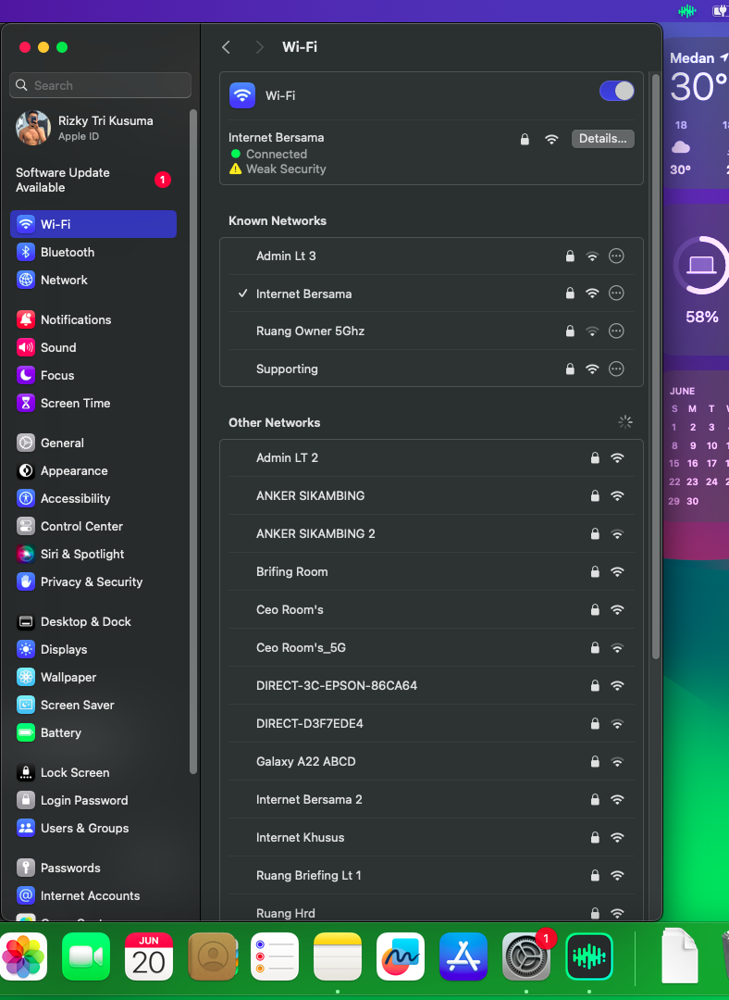

# Hackintosh-Lenovo-Flex15IIL-macOS-Sonoma-Touchscreen
# 💻 Hackintosh for Lenovo IdeaPad Flex 15IIL – macOS Sonoma 14.7 (Full Touchscreen Support)

**EFI Hackintosh untuk Lenovo Flex 15IIL (i5-1035G1) dengan macOS Sonoma 14.7. Touchscreen full aktif menggunakan VoodooI2C + I2CHID.**  
Support multitouch, scroll dua jari, drag, dan klik — sangat jarang ditemukan di laptop touchscreen Hackintosh lainnya! 😱🔥

---

## ✅ Fitur Utama

| Komponen                        | Status         |
|--------------------------------|----------------|
| CPU: Intel Core i5-1035G1      | ✅ Full support |
| GPU: Intel UHD Graphics (iGPU) | ✅ Acceleration |
| Layar Sentuh (Touchscreen)     | ✅ Fully working |
| Multitouch Gesture             | ✅ Fully working |
| Wi-Fi (itlwm + HeliPort)       | ✅ Aktif & stabil |
| Bluetooth                      | ✅ Fully working |
| Audio Internal                 | ✅ (VoodooHDA)  |
| Sleep/Wake                     | ✅ Jalan normal |
| HDMI Display                   | ❌ Ngga Bisa di Icelake |
| SD Card Reader                 | ❌ Belum support |

---

## 🔧 Kext yang Digunakan

- `Lilu.kext`
- `WhateverGreen.kext`
- `VirtualSMC.kext`
- `VoodooI2C.kext` (v2.8.2)
- `VoodooI2CHID.kext`
- `itlwm.kext` (khusus Sonoma 14.7) atau AirportItlwm 14.4+
- `HeliPort.app`
- `AppleALC.kext` *(opsional tergantung codec)*

---

## 🧭 Panduan Instalasi Singkat

1. **Clone repo ini**, mount USB installer, salin folder `EFI` ke partisi EFI
2. Edit `config.plist` → sesuaikan SMBIOS (gunakan MacBookAir9,1 untuk Ice Lake)
3. Gunakan OpenCore configurator (versi yang cocok dengan OC kamu, misal 0.9.4)
4. Boot ke macOS Installer → install hingga selesai
5. Gunakan `HeliPort.app` untuk koneksi Wi-Fi via itlwm atau langsung kalau pakai AirportItlwm 14.4+
6. Nikmati touchscreen + macOS di Lenovo Flex kamu 😎

---

## 📸 Screenshot Lainnya

| Touchscreen aktif | IORegistry info | WiFi terkoneksi |
|-------------------|------------------|----------------------|
|  |  |  |

---

## 🌍 Bahasa Indonesia & Inggris

### 🇮🇩 Tentang Proyek Ini
EFI ini ditujukan untuk pengguna Lenovo Flex 15IIL yang ingin menjalankan macOS Sonoma. Uniknya, touchscreen di laptop ini bisa aktif penuh dengan gesture dan responsif!

### 🇬🇧 About This Project
This EFI enables macOS Sonoma 14.7 on Lenovo IdeaPad Flex 15IIL with full touchscreen support via VoodooI2C + I2CHID. Includes Wi-Fi, iGPU acceleration, sleep/wake, and gesture support.

---

## 💬 Kredit & Kontribusi

Proyek ini dibuat oleh [rizkytrikusumaoff](https://github.com/rizkytrikusumaoff)  
Kontribusi, bug report, dan pull request sangat diterima!

---

## ⚠️ Catatan Penting
- HDMI audio & card reader belum berfungsi
- Gunakan itlwm versi khusus Sonoma 14.7 atau AirportItlwm 14.4+
- Touchscreen memerlukan `VoodooI2C` + SSDT-GPIO/I2C yang sudah disertakan

---

